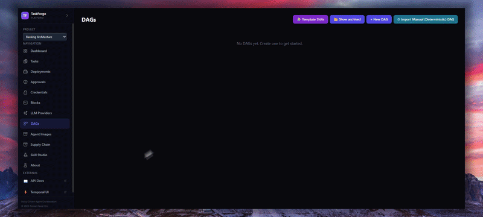
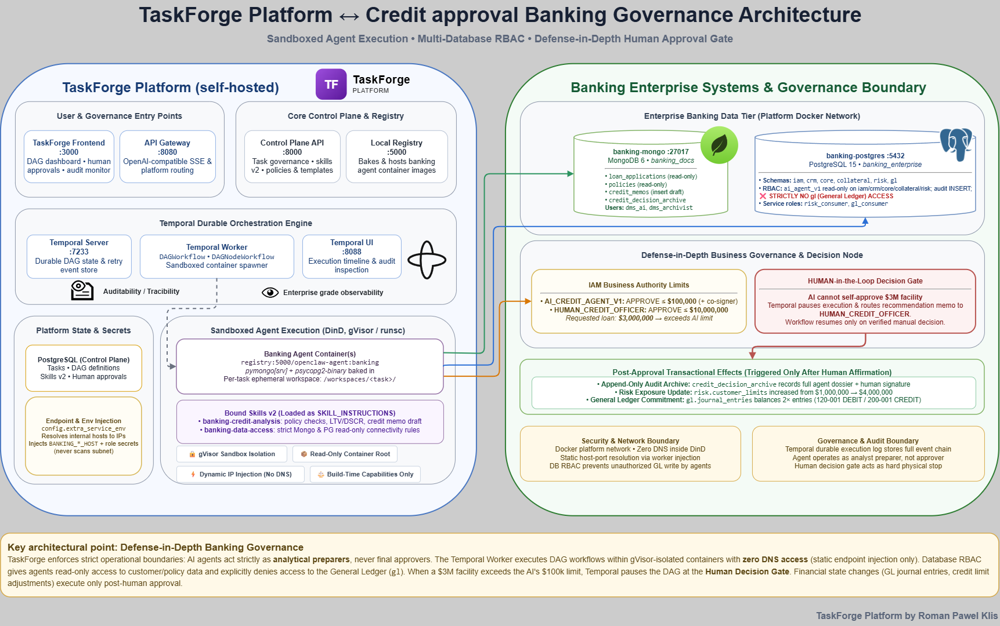

# Banking Governance — showcase example

<p align="center">
   <strong>Banking Governance</strong> — a TaskForge showcase
  <br>
  <em>driven by  OpenClaw ·
  orchestrated by  Temporal ·
  sandboxed with  Docker/gVisor</em>
</p>

Demonstrates the platform running an enterprise-bank credit workflow with a strict
governance model: an **AI credit agent** reads the loan application and policy (MongoDB
`banking_docs`), queries customer/KYC, exposure and collateral (PostgreSQL
`banking_enterprise`), computes LTV and DSCR, drafts a credit memo, and **cannot approve** a
$3M facility (its authority is $100K) — so it routes to a **HUMAN_CREDIT_OFFICER** decision
node. Only after human approval do the archive, risk (1M → 4M) and GL (two journal entries)
steps run, each under its own service account. No message broker.

> Co-created in collaboration with
> [Stefan Bergsten](https://www.linkedin.com/in/stefan-bergsten-a3095618/).

## What it shows
- Project-scoped DAG template + skill (`banking-architecture` project).
- Enterprise systems on the platform network: MongoDB (`banking-mongo`) and PostgreSQL
  (`banking-postgres`) with deterministic demo data.
- Defense in depth: network membership + DB RBAC (`ai_agent_v1` read-only, no `gl` schema) +
  IAM business authorizations (AI ≤ $100K, officer ≤ $10M) + human approval gate.
- Detailed TaskForge agent prompts that name exactly where each system lives; the planner can
  regenerate the same DAG from `planning-objective.md`.

## Live run

A real execution of this example's banking DAG — agents reading the banking systems under the
governance model (skills v2 + injected endpoints), the authority check, and the human approval
gate:

<p align="center">
  
</p>

## Architecture diagram



`taskforge-banking-integration.xml` is the editable [draw.io](https://www.diagrams.net/)
source of the diagram above (open it in draw.io / diagrams.net, or drag it onto
https://app.diagrams.net). It contains two pages:

- **Architecture** — how the self-hosted TaskForge platform connects to the dedicated banking
  systems: entry points, control plane/Temporal/worker, sandboxed agent execution on the
  `openclaw-agent:banking` image (pymongo + psycopg2 baked in), worker endpoint injection
  (`config.extra_service_env`), MongoDB `banking_docs`, PostgreSQL `banking_enterprise` with
  its RBAC logins, skills v2, and the governance layers (IAM limits, human approval gate,
  post-approval-only risk/GL effects).
- **Banking Workflow (dag-3851ca63)** — the concrete run as a swimlane diagram
  (TaskForge/Temporal · agent image · MongoDB · PostgreSQL · human): the five completed
  analysis nodes with skills and timings, the authority verdict (cannot self-approve $3M),
  the paused human decision, and the pending post-approval risk/GL node.

### Planner prompt for this execution

This is the exact TaskForge planner prompt that produced the run shown in the workflow page
(dag-3851ca63) — it yields the granular per-step nodes: fetch → IAM authority → KYC/AML/
exposure/collateral → LTV+DSCR → memo → human decision → post-approval updates:

> Analyze commercial loan application APP-2026-0899 (TechFlow Solutions LLC, USD 3,000,000
> term loan) using the bank's governance data and produce a credit recommendation. Retrieve
> the application and policy from the banking_docs document system (MongoDB), verify IAM
> authority, customer KYC/AML status, existing credit exposure, collateral, then calculate
> LTV and DSCR against Commercial Lending Policy POL-COM-2026. Draft a credit memo, and route
> the decision to a HUMAN_CREDIT_OFFICER because the amount exceeds the AI approval limit.
> Never self-approve and never post GL or risk updates: those happen only in post-approval
> steps. Make sure steps are covered granularly.

See `docs/architecture-diagram.md` for the full description and the node-by-node run narrative.

## Run
```bash
make example-up NAME=banking-architecture
# open the frontend, pick project "banking-architecture", instantiate the
# "banking-credit-governance" template, run it, and approve the human decision node
make example-down NAME=banking-architecture
```

On a clean environment `make example-up` is self-contained: it builds/pushes the
`openclaw-agent:banking` image if missing, registers the banking agent-image profile, imports
the banking skills v2 (`banking-data-access`, `banking-credit-analysis`) as ACTIVE, and then
imports the DAG template — which references its skills by **name**
(`selected_skill_name`), so the ids are resolved on whatever platform you run against (no
hardcoded `skv2-…` ids).

## Verify
```bash
cd examples/banking-architecture
cp .env.example .env               # needed by the verification scripts (defaults are demo-only)
bash scripts/verify.sh             # schemas, data, RBAC (ai_agent_v1 denied on gl)
bash scripts/tests/run.sh          # six governance/idempotency tests
```

## Architecture

The credit flow as a TaskForge DAG: `fetch-application` → `check-kyc` →
`check-exposure-collateral` → `credit-memo-recommend` → `authority-check` →
`human-approval` (decision) → `finalize-approval` → `update-risk` → `post-gl` →
`verify-downstream`. Key figures: LTV = 3M/5M = 60% (≤ 75%), DSCR = 3.5M/(0.5M+0.7M) = 2.92
(≥ 1.25) using the explicit `proposed_annual_debt_service_usd` stored on the application.
See `docs/architecture.md` for details and `docs/worker-extension.md` for the worker-side
endpoint-injection change agent nodes need to reach the banking systems.

## Files
- `example.yaml` — manifest.
- `execution-example.gif` — recorded live run of the banking DAG (shown above).
- `taskforge-banking-integration.xml` — editable draw.io architecture + workflow diagram
  (two pages: Architecture, Banking Workflow/dag-3851ca63).
- `taskforge-banking-integration.png` — rendered diagram (re-export after XML edits).
- `docs/architecture-diagram.md` — diagram description + how dag-3851ca63 ran.
- `docker-compose.yml` — banking-mongo + banking-postgres on the platform network.
- `config/dags/banking-credit-governance.json` — the curated DAG template (agent nodes run on
  the `banking` agent image: `registry:5000/openclaw-agent:banking`, built via
  `make build-banking`, with pymongo + psycopg2 baked in).
- `config/skills/` — `banking-credit-analysis.md` (analysis steps),
  `banking-postgres.md` + `banking-mongo.md` (database connectivity skills), and the
  `*.skill.json` definitions imported as ACTIVE v2 skills at `make example-up`.
- `planning-objective.md` — single-objective text for the planner path.
- `init-pg/`, `init-mongo/` — schema/data/RBAC and document-system bootstrap.
- `scripts/` — healthcheck/verify/reset/demo/approve/grant-capability + governance tests.
- `docs/architecture.md`, `docs/worker-extension.md`.
