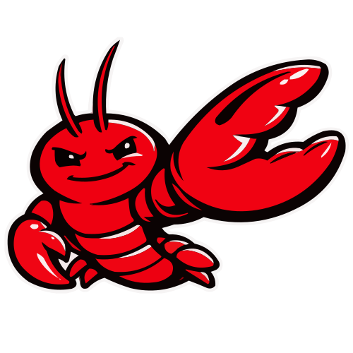
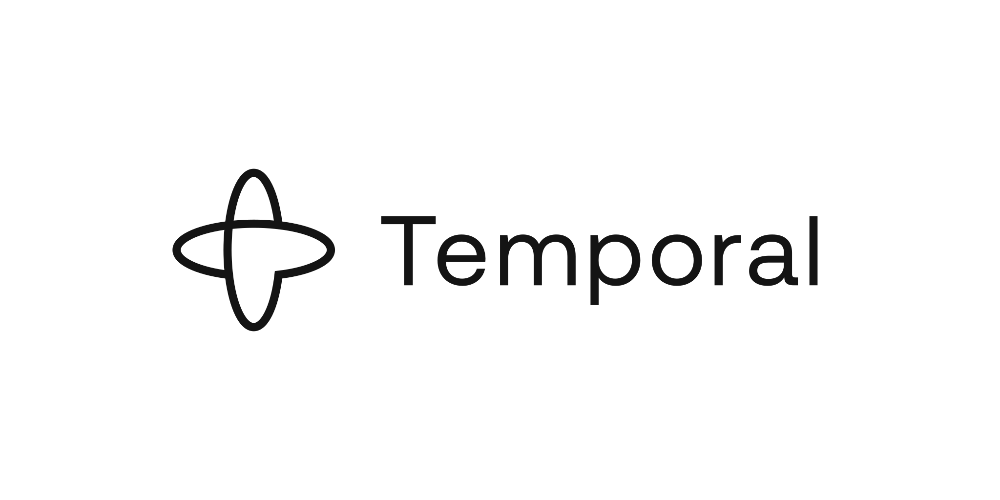
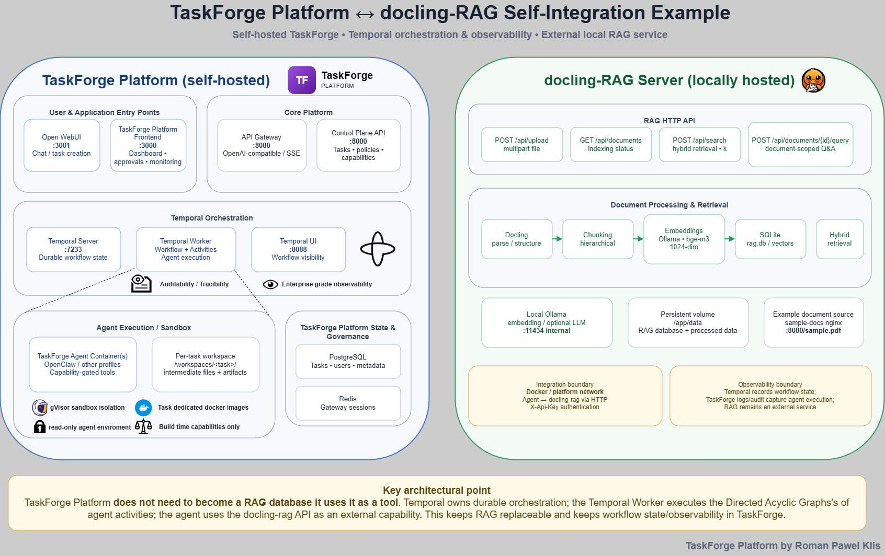
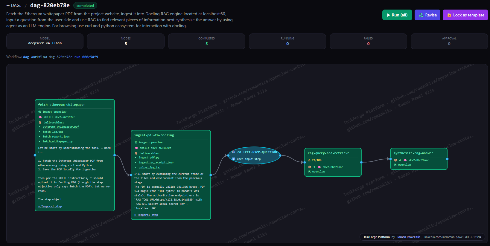
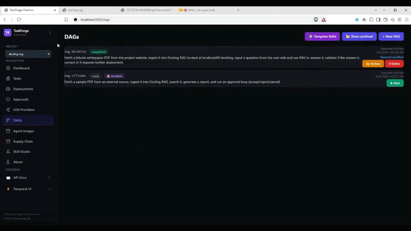

# Docling RAG — showcase example

<p align="center">
   <strong>Docling RAG</strong> — a TaskForge showcase
  <br>
  <em>driven by  OpenClaw ·
  orchestrated by  Temporal ·
  sandboxed with  Docker/gVisor</em>
</p>

Demonstrates the platform driving an **external tool** end-to-end: the Docling
RAG service (moved out of the core compose into this example) is used to ingest
a PDF, search it with hybrid retrieval, and produce an approved report — with a
closed-loop approval (accept / reject → rework / cancel).

## What it shows
- Project-scoped DAG template + skill (`docling-rag` project).
- Agents using an **external tool**: a sample PDF served by `sample-docs`, then
  uploaded to Docling RAG, searched, and summarised into a report.
- A closed-loop approval gate on the report.
- Skill learning isolated to this project.

## Architecture diagram



`taskforge-docling-rag-integration.xml` is the editable
[draw.io](https://www.diagrams.net/) source of the diagram above (open it in
draw.io / diagrams.net, or drag it onto https://app.diagrams.net). It contains
two pages:

- **Architecture** — how the self-hosted TaskForge Platform connects to the
  external docling-RAG service: entry points (Open WebUI `:3001`, TaskForge
  Frontend `:3000`), core platform (API Gateway `:8080`, Control Plane `:8000`),
  Temporal orchestration (server `:7233`, worker, UI `:8088`), sandboxed agent
  execution with per-task workspaces, platform state & governance (PostgreSQL),
  and the docling-RAG side (SQLite/vectors + a local Ollama `bge-m3` embeddings
  provider that never shadows a host Ollama).
- **RAG Workflow** — the concrete end-to-end flow as a swimlane diagram
  (TaskForge/Temporal · agent activities · docling-RAG): `fetch-sample-doc`
  downloads `sample.pdf` from `sample-docs` → `upload-to-rag` posts it to
  `/api/upload` and captures the `document_id` → the workflow waits for
  `indexed` status (`GET /api/documents`) → `search-rag` runs hybrid retrieval
  (`POST /api/search`, `mode=hybrid, k=5`) → `generate-report` writes
  `report.md` → **human approval** (accept / reject / cancel, with a rework
  branch) → finalize. A callout explains why this is a durable Temporal
  workflow rather than ad-hoc HTTP calls: retries on failure, pause/resume for
  human approval, and full history in Temporal UI.

## Live run

A real execution of this example's DAG — parallel steps, live LLM-turn counters per node, and the approval gate:

<p align="center">
  
</p>

<p align="center">
  
</p>

## Run
```bash
make example-up NAME=docling-rag
# open the frontend, pick project "docling-rag", instantiate the "rag-report" template
make example-down NAME=docling-rag
```

## Files
- `taskforge-docling-rag-integration-Architecture.drawio.png` — rendered
  architecture diagram (exported from the `.xml`; re-export after edits).
- `taskforge-docling-rag-integration.xml` — draw.io architecture + workflow
  diagram (editable source).
- `example.yaml` — manifest.
- `docker-compose.yml` — **Docling RAG + Ollama** (moved here from the core
  compose so the main `docker-compose.yml` stays clean), plus `sample-docs`
  (nginx) serving `data/sample.pdf` on the platform network.
- `config/dags/rag-report.json` — DAG template (fetch → upload RAG → search → report → approval loop).
- `config/skills/docling-rag.md` — skill describing the Docling RAG API usage.
- `data/sample.pdf` — the sample document ingested into the RAG.
